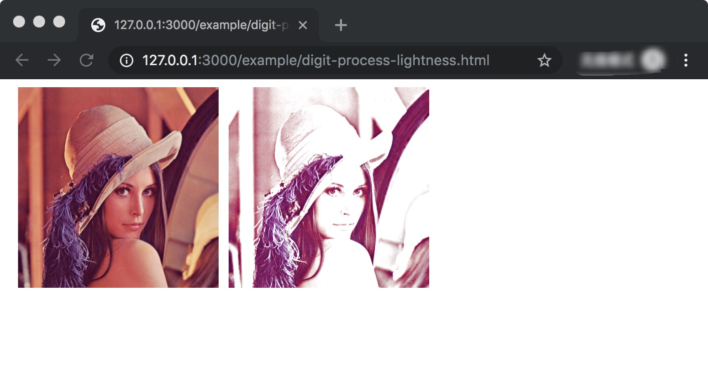
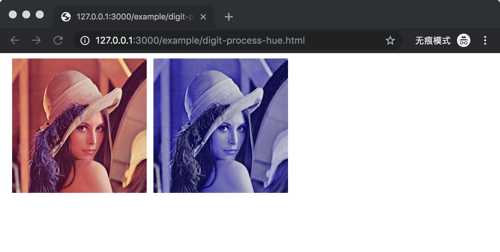
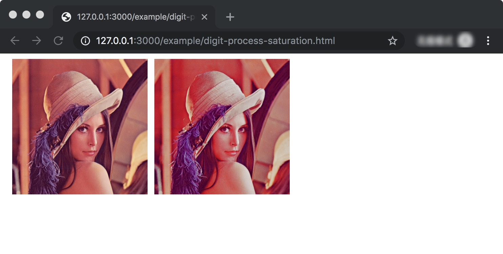
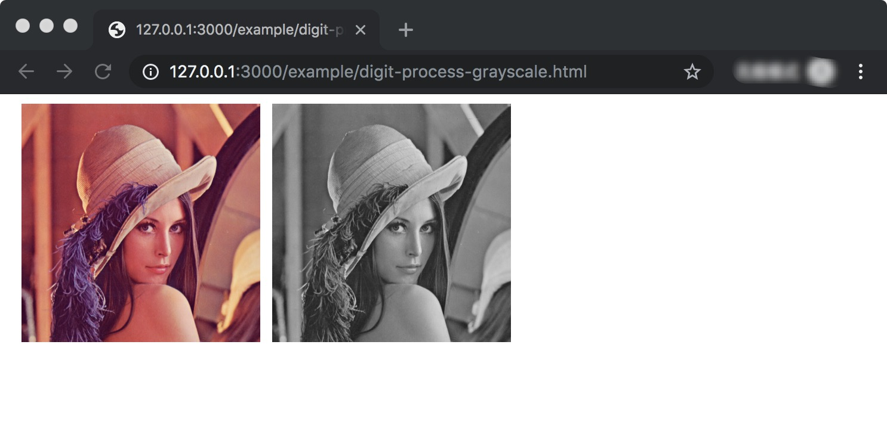
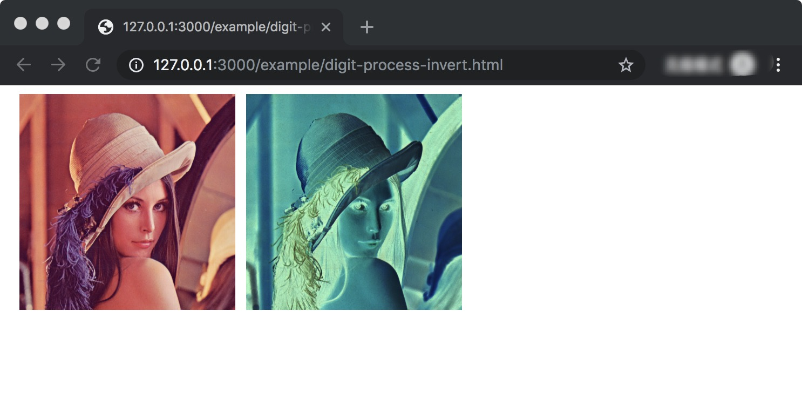
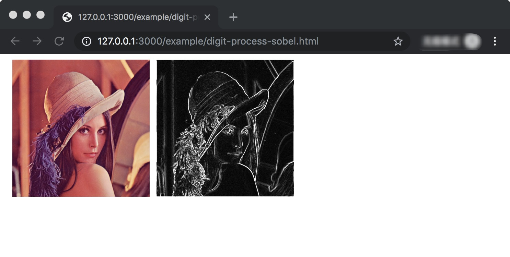

# Pictool.digit.process

## digit.process 

```js
const process = Pictool.digit.process;
```


## process.lightness


```js
const result = Pictool.digit.process.lightness(digitImg, options)
```

- param `digitImg {DigitImageData}`
- param `options {object}`
  - `options.percent {number}` `[-100, 100]`
  - `options.value {number}` `[0, 100]`
  - Only `value` is valid when both come together `value`

```js
const process = Pictool.digit.process;

// Raise the brightness 70%
const rsDigitImg = process.lightness(digitImg, { percent: 70 });

// Set the brightness value to 50
const rsDigitImg = process.lightness(digitImg, { value: 50 });
```

#### process.lightness CDN Usage


```html
<html>
  <head>
    <meta charset="UTF-8">
    <style>
      .box {width: 200px; height: 200px; float: left; margin-left: 10px; }
      img { max-height: 200px; max-width: 200px; }
    </style>
    <script src="https://unpkg.com/pictool/dist/index.js"></script>
  </head>
  <body>

    <div class="box">
      
    </div>

    <div  class="box" id="J_Example"></div>

  </body>
  <script>
  (async function(Pictool) {
    const util = Pictool.browser.util;
    const process = Pictool.digit.process;
    const imgData = await util.getImageDataBySrc('./assets/image/test.jpg');
    if (imgData instanceof Error) {
      console.log(imgData);
      return;
    }

    const digitImg = util.imageData2DigitImageData(imgData);

    // Raise the brightness 70%
    const rsDigitImg = process.lightness(digitImg, { percent: 70 });
    
    const rsImgData = util.digitImageData2ImageData(rsDigitImg);
    const base64 = util.imageData2Base64(rsImgData);

    document.getElementById('J_Example').innerHTML = ``

  })(window.Pictool);
  </script>
</html>
```





## process.hue


```js
const result = Pictool.digit.process.hue(digitImg, options)
```

- param `digitImg {DigitImageData}`
- param `options {object}`
  - `options.percent {number}`  `[-100, 100]`
  - `options.value {number}`  `[0, 360]`
  - Only `value` is valid when both come together `value`
- return `{DigitImageData}`

```js
const process = Pictool.digit.process;

// Raise the hue 10%
const rsDigitImg = process.hue(digitImg, { percent: 10 });

// Set the hue value to 240
const rsDigitImg = process.hue(digitImg, { value: 240 });
```

#### process.hue CDN Usage

```html
<html>
  <head>
    <meta charset="UTF-8">
    <style>
      .box {width: 200px; height: 200px; float: left; margin-left: 10px; }
      img { max-height: 200px; max-width: 200px; }
    </style>
    <script src="https://unpkg.com/pictool/dist/index.js"></script>
  </head>
  <body>

    <div class="box">
      
    </div>

    <div  class="box" id="J_Example"></div>

  </body>
  <script>
  (async function(Pictool) {
    const util = Pictool.browser.util;
    const process = Pictool.digit.process;
    const imgData = await util.getImageDataBySrc('./assets/image/test.jpg');
    if (imgData instanceof Error) {
      console.log(imgData);
      return;
    }

    const digitImg = util.imageData2DigitImageData(imgData);

    // 色相值设置为 240
    const rsDigitImg = process.hue(digitImg, { value: 240 });
    
    const rsImgData = util.digitImageData2ImageData(rsDigitImg);
    const base64 = util.imageData2Base64(rsImgData);

    document.getElementById('J_Example').innerHTML = ``

  })(window.Pictool);
  </script>
</html>
```





## process.saturation


```js
const result = Pictool.digit.process.saturation(digitImg, options)
```

- param `digitImg {DigitImageData}`
- param `options {object}`
  - `options.percent {number}`  `[-100, 100]`
  - `options.value {number}`  `[0, 100]`
  - Only `value` is valid when both come together `value`
- return `{DigitImageData}` 

```js
const process = Pictool.digit.process;

// Raise the hue 70%
const rsDigitImg = process.saturation(digitImg, { percent: 70 });

// Set the saturation value to 50
const rsDigitImg = process.saturation(digitImg, { value: 50 });
```

#### process.saturation CDN Usage

```html
<html>
  <head>
    <meta charset="UTF-8">
    <style>
      .box {width: 200px; height: 200px; float: left; margin-left: 10px; }
      img { max-height: 200px; max-width: 200px; }
    </style>
    <script src="https://unpkg.com/pictool/dist/index.js"></script>
  </head>
  <body>

    <div class="box">
      
    </div>

    <div  class="box" id="J_Example"></div>

  </body>
  <script>
  (async function(Pictool) {
    const util = Pictool.browser.util;
    const process = Pictool.digit.process;
    const imgData = await util.getImageDataBySrc('./assets/image/test.jpg');
    if (imgData instanceof Error) {
      console.log(imgData);
      return;
    }

    const digitImg = util.imageData2DigitImageData(imgData);

    // 饱和度提高 70%
    const rsDigitImg = process.saturation(digitImg, { percent: 70 });
    
    const rsImgData = util.digitImageData2ImageData(rsDigitImg);
    const base64 = util.imageData2Base64(rsImgData);

    document.getElementById('J_Example').innerHTML = ``

  })(window.Pictool);
  </script>
</html>
```





## process.grayscale 


```js
const result = Pictool.digit.process.saturation(digitImg)
```

- param `digitImg {DigitImageData}`
- return `{DigitImageData}`

```js
const process = Pictool.digit.process;

const rsDigitImg = process.grayscale(digitImg);
```

#### process.grayscale CDN Usage

```html
<html>
  <head>
    <meta charset="UTF-8">
    <style>
      .box {width: 200px; height: 200px; float: left; margin-left: 10px; }
      img { max-height: 200px; max-width: 200px; }
    </style>
    <script src="https://unpkg.com/pictool/dist/index.js"></script>
  </head>
  <body>

    <div class="box">
      
    </div>

    <div  class="box" id="J_Example"></div>

  </body>
  <script>
  (async function(Pictool) {
    const util = Pictool.browser.util;
    const process = Pictool.digit.process;
    const imgData = await util.getImageDataBySrc('./assets/image/test.jpg');
    if (imgData instanceof Error) {
      console.log(imgData);
      return;
    }

    const digitImg = util.imageData2DigitImageData(imgData);

    const rsDigitImg = process.grayscale(digitImg);
    
    const rsImgData = util.digitImageData2ImageData(rsDigitImg);
    const base64 = util.imageData2Base64(rsImgData);

    document.getElementById('J_Example').innerHTML = ``

  })(window.Pictool);
  </script>
</html>
```





## process.invert


```js
const result = Pictool.digit.process.invert(digitImg)
```

- param `digitImg {DigitImageData}`
- return `{DigitImageData}` 

```js
const process = Pictool.digit.process;

const rsDigitImg = process.invert(digitImg);
```

#### process.invert CDN Usage

```html
<html>
  <head>
    <meta charset="UTF-8">
    <style>
      .box {width: 200px; height: 200px; float: left; margin-left: 10px; }
      img { max-height: 200px; max-width: 200px; }
    </style>
    <script src="https://unpkg.com/pictool/dist/index.js"></script>
  </head>
  <body>

    <div class="box">
      
    </div>

    <div  class="box" id="J_Example"></div>

  </body>
  <script>
  (async function(Pictool) {
    const util = Pictool.browser.util;
    const process = Pictool.digit.process;
    const imgData = await util.getImageDataBySrc('./assets/image/test.jpg');
    if (imgData instanceof Error) {
      console.log(imgData);
      return;
    }

    const digitImg = util.imageData2DigitImageData(imgData);

    const rsDigitImg = process.invert(digitImg);
    
    const rsImgData = util.digitImageData2ImageData(rsDigitImg);
    const base64 = util.imageData2Base64(rsImgData);

    document.getElementById('J_Example').innerHTML = ``

  })(window.Pictool);
  </script>
</html>
```





## process.sobel


```js
const result = Pictool.digit.process.sobel(digitImg)
```


- param `digitImg {DigitImageData}`
- return `{DigitImageData}`


```js
const process = Pictool.digit.process;

const rsDigitImg = process.sobel(digitImg);
```

#### process.sobel CDN Usage

```html
<html>
  <head>
    <meta charset="UTF-8">
    <style>
      .box {width: 200px; height: 200px; float: left; margin-left: 10px; }
      img { max-height: 200px; max-width: 200px; }
    </style>
    <script src="https://unpkg.com/pictool/dist/index.js"></script>
  </head>
  <body>

    <div class="box">
      
    </div>

    <div  class="box" id="J_Example"></div>

  </body>
  <script>
  (async function(Pictool) {
    const util = Pictool.browser.util;
    const process = Pictool.digit.process;
    const imgData = await util.getImageDataBySrc('./assets/image/test.jpg');
    if (imgData instanceof Error) {
      console.log(imgData);
      return;
    }

    const digitImg = util.imageData2DigitImageData(imgData);

    // sobel
    const rsDigitImg = process.sobel(digitImg);
    
    const rsImgData = util.digitImageData2ImageData(rsDigitImg);
    const base64 = util.imageData2Base64(rsImgData);

    document.getElementById('J_Example').innerHTML = ``

  })(window.Pictool);
  </script>
</html>
```




