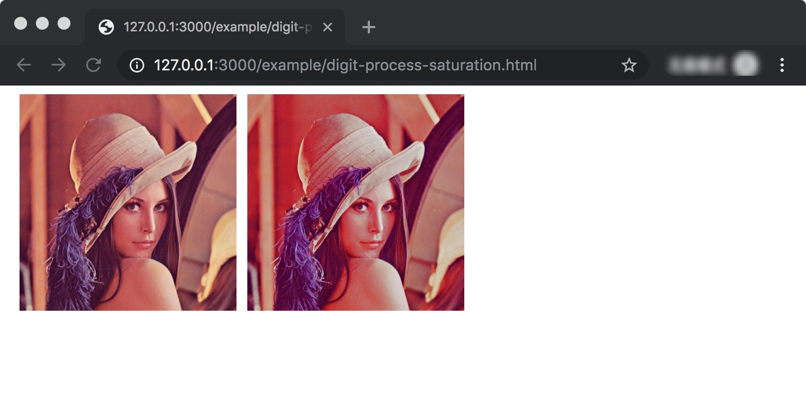
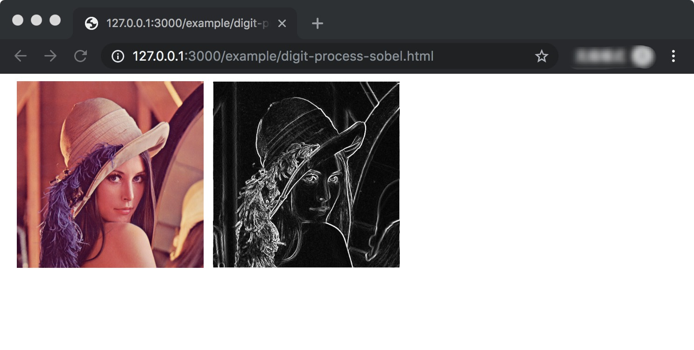

# Pictool.digit.process

## 图像处理对象 digit.process 

```js
const process = Pictool.digit.process;
```

数字化处理图像操作对象，封装了几个常用的图像处理操作方法。

封装的方法，都是是将原类型为 `{DigitImageData}` 的图像数字数据，进行响应的要求图像处理，最后输出一个处理后的 `{DigitImageData}` 数据

## 亮度 process.lightness

图像`亮度`处理

```js
const result = Pictool.digit.process.lightness(digitImg, options)
```

- 参数 `digitImg {DigitImageData}` 待处理的数字图像数据
- 参数 `options {object}`
  - `options.percent {number}` 百分比， 取值范围为`[-100, 100]`
  - `options.value {number}` 亮度值， 取值范围为`[0, 100]`
  - `value`优先级最高，当`percent`和`value`同时出现，只取`value`配置
- 返回 `{DigitImageData}` 处理后的数字图像数据

```js
const process = Pictool.digit.process;

// 将亮度提升 70%
const rsDigitImg = process.lightness(digitImg, { percent: 70 });

// 将亮度值设为 50
const rsDigitImg = process.lightness(digitImg, { value: 50 });
```

#### process.lightness CDN方式使用例子


```html
<html>
  <head>
    <meta charset="UTF-8">
    <style>
      .box {width: 200px; height: 200px; float: left; margin-left: 10px; }
      img { max-height: 200px; max-width: 200px; }
    </style>
    <script src="https://unpkg.com/pictool/dist/index.js"></script>
  </head>
  <body>

    <div class="box">
      
    </div>

    <div  class="box" id="J_Example"></div>

  </body>
  <script>
  (async function(Pictool) {
    const util = Pictool.browser.util;
    const process = Pictool.digit.process;
    const imgData = await util.getImageDataBySrc('./assets/image/test.jpg');
    if (imgData instanceof Error) {
      console.log(imgData);
      return;
    }

    const digitImg = util.imageData2DigitImageData(imgData);

    // 亮度提高 70%
    const rsDigitImg = process.lightness(digitImg, { percent: 70 });
    
    const rsImgData = util.digitImageData2ImageData(rsDigitImg);
    const base64 = util.imageData2Base64(rsImgData);

    document.getElementById('J_Example').innerHTML = ``

  })(window.Pictool);
  </script>
</html>
```

效果如下

> 注: 测试例子所用图片来源于网络


## 色相 process.hue

图像`色相`处理

```js
const result = Pictool.digit.process.hue(digitImg, options)
```

- 参数 `digitImg {DigitImageData}` 待处理的数字图像数据
- 参数 `options {object}`
  - `options.percent {number}` 色相百分比， 取值范围为`[-100, 100]`
  - `options.value {number}` 色相值， 取值范围为`[0, 360]`
  - `value`优先级最高，当`percent`和`value`同时出现，只取`value`配置
- 返回 `{DigitImageData}` 处理后的数字图像数据

```js
const process = Pictool.digit.process;

// 将色相提升 10%
const rsDigitImg = process.hue(digitImg, { percent: 10 });

// 将色相值设为 240
const rsDigitImg = process.hue(digitImg, { value: 240 });
```

#### process.hue CDN方式使用例子

```html
<html>
  <head>
    <meta charset="UTF-8">
    <style>
      .box {width: 200px; height: 200px; float: left; margin-left: 10px; }
      img { max-height: 200px; max-width: 200px; }
    </style>
    <script src="https://unpkg.com/pictool/dist/index.js"></script>
  </head>
  <body>

    <div class="box">
      
    </div>

    <div  class="box" id="J_Example"></div>

  </body>
  <script>
  (async function(Pictool) {
    const util = Pictool.browser.util;
    const process = Pictool.digit.process;
    const imgData = await util.getImageDataBySrc('./assets/image/test.jpg');
    if (imgData instanceof Error) {
      console.log(imgData);
      return;
    }

    const digitImg = util.imageData2DigitImageData(imgData);

    // 色相值设置为 240
    const rsDigitImg = process.hue(digitImg, { value: 240 });
    
    const rsImgData = util.digitImageData2ImageData(rsDigitImg);
    const base64 = util.imageData2Base64(rsImgData);

    document.getElementById('J_Example').innerHTML = ``

  })(window.Pictool);
  </script>
</html>
```

效果如下

> 注: 测试例子所用图片来源于网络


## 饱和度 process.saturation

图像`饱和度`处理

```js
const result = Pictool.digit.process.saturation(digitImg, options)
```

- 参数 `digitImg {DigitImageData}` 待处理的数字图像数据
- 参数 `options {object}`
  - `options.percent {number}` 饱和度百分比， 取值范围为`[-100, 100]`
  - `options.value {number}` 饱和度值， 取值范围为`[0, 100]`
  - `value`优先级最高，当`percent`和`value`同时出现，只取`value`配置
- 返回 `{DigitImageData}` 处理后的数字图像数据

```js
const process = Pictool.digit.process;

// 将饱和度提升 70%
const rsDigitImg = process.saturation(digitImg, { percent: 70 });

// 将饱和度值设为 50
const rsDigitImg = process.saturation(digitImg, { value: 50 });
```

#### process.saturation CDN方式使用例子

```html
<html>
  <head>
    <meta charset="UTF-8">
    <style>
      .box {width: 200px; height: 200px; float: left; margin-left: 10px; }
      img { max-height: 200px; max-width: 200px; }
    </style>
    <script src="https://unpkg.com/pictool/dist/index.js"></script>
  </head>
  <body>

    <div class="box">
      
    </div>

    <div  class="box" id="J_Example"></div>

  </body>
  <script>
  (async function(Pictool) {
    const util = Pictool.browser.util;
    const process = Pictool.digit.process;
    const imgData = await util.getImageDataBySrc('./assets/image/test.jpg');
    if (imgData instanceof Error) {
      console.log(imgData);
      return;
    }

    const digitImg = util.imageData2DigitImageData(imgData);

    // 饱和度提高 70%
    const rsDigitImg = process.saturation(digitImg, { percent: 70 });
    
    const rsImgData = util.digitImageData2ImageData(rsDigitImg);
    const base64 = util.imageData2Base64(rsImgData);

    document.getElementById('J_Example').innerHTML = ``

  })(window.Pictool);
  </script>
</html>
```

效果如下

> 注: 测试例子所用图片来源于网络




## 透明度 process.alpha 

图像`透明度`处理

```js
const result = Pictool.digit.process.alpha(digitImg, options)
```

- 参数 `digitImg {DigitImageData}` 待处理的数字图像数据
- 参数 `options {object}`
  - `options.percent {number}` 透明度百分比， 取值范围为`[-100, 100]`
  - `options.value {number}` 透明度值， 取值范围为`[0, 100]`
  - `value`优先级最高，当`percent`和`value`同时出现，只取`value`配置
- 返回 `{DigitImageData}` 处理后的数字图像数据

#### process.hue CDN方式使用例子

```html
<html>
  <head>
    <meta charset="UTF-8">
    <style>
      .box {width: 200px; height: 200px; float: left; margin-left: 10px; }
      img { max-height: 200px; max-width: 200px; }
    </style>
    <script src="https://unpkg.com/pictool/dist/index.js"></script>
  </head>
  <body>

    <div class="box">
      
    </div>

    <div  class="box" id="J_Example"></div>

  </body>
  <script>
  (async function(Pictool) {
    const util = Pictool.browser.util;
    const process = Pictool.digit.process;
    const imgData = await util.getImageDataBySrc('./assets/image/test.jpg');
    if (imgData instanceof Error) {
      console.log(imgData);
      return;
    }
    const digitImg = util.imageData2DigitImageData(imgData);
    // 透明度 降低 40%
    const rsDigitImg = process.alpha(digitImg, { percent: -40 });
    
    const rsImgData = util.digitImageData2ImageData(rsDigitImg);
    const base64 = util.imageData2Base64(rsImgData);
    document.getElementById('J_Example').innerHTML = ``
  })(window.Pictool);
  </script>
</html>
```

效果如下

> 注: 测试例子所用图片来源于网络


## 灰度 process.grayscale 

图像`灰度`处理

```js
const result = Pictool.digit.process.saturation(digitImg)
```

- 参数 `digitImg {DigitImageData}` 待处理的数字图像数据
- 返回 `{DigitImageData}` 处理后的数字图像数据

```js
const process = Pictool.digit.process;

// 灰度处理
const rsDigitImg = process.grayscale(digitImg);
```

#### process.grayscale CDN方式使用例子

```html
<html>
  <head>
    <meta charset="UTF-8">
    <style>
      .box {width: 200px; height: 200px; float: left; margin-left: 10px; }
      img { max-height: 200px; max-width: 200px; }
    </style>
    <script src="https://unpkg.com/pictool/dist/index.js"></script>
  </head>
  <body>

    <div class="box">
      
    </div>

    <div  class="box" id="J_Example"></div>

  </body>
  <script>
  (async function(Pictool) {
    const util = Pictool.browser.util;
    const process = Pictool.digit.process;
    const imgData = await util.getImageDataBySrc('./assets/image/test.jpg');
    if (imgData instanceof Error) {
      console.log(imgData);
      return;
    }

    const digitImg = util.imageData2DigitImageData(imgData);

    // 灰度图处理
    const rsDigitImg = process.grayscale(digitImg);
    
    const rsImgData = util.digitImageData2ImageData(rsDigitImg);
    const base64 = util.imageData2Base64(rsImgData);

    document.getElementById('J_Example').innerHTML = ``

  })(window.Pictool);
  </script>
</html>
```

效果如下

> 注: 测试例子所用图片来源于网络


## 反色 process.invert

图像`反色`处理

```js
const result = Pictool.digit.process.invert(digitImg)
```

- 参数 `digitImg {DigitImageData}` 待处理的数字图像数据
- 返回 `{DigitImageData}` 处理后的数字图像数据

```js
const process = Pictool.digit.process;

// 反色 处理
const rsDigitImg = process.invert(digitImg);
```

#### process.invert CDN方式使用例子

```html
<html>
  <head>
    <meta charset="UTF-8">
    <style>
      .box {width: 200px; height: 200px; float: left; margin-left: 10px; }
      img { max-height: 200px; max-width: 200px; }
    </style>
    <script src="https://unpkg.com/pictool/dist/index.js"></script>
  </head>
  <body>

    <div class="box">
      
    </div>

    <div  class="box" id="J_Example"></div>

  </body>
  <script>
  (async function(Pictool) {
    const util = Pictool.browser.util;
    const process = Pictool.digit.process;
    const imgData = await util.getImageDataBySrc('./assets/image/test.jpg');
    if (imgData instanceof Error) {
      console.log(imgData);
      return;
    }

    const digitImg = util.imageData2DigitImageData(imgData);

    // 反色 处理
    const rsDigitImg = process.invert(digitImg);
    
    const rsImgData = util.digitImageData2ImageData(rsDigitImg);
    const base64 = util.imageData2Base64(rsImgData);

    document.getElementById('J_Example').innerHTML = ``

  })(window.Pictool);
  </script>
</html>
```

效果如下

> 注: 测试例子所用图片来源于网络


## sobel边缘检测 process.sobel

图像 `sobel边缘检测`

```js
const result = Pictool.digit.process.sobel(digitImg)
```


- 参数 `digitImg {DigitImageData}` 待处理的数字图像数据
- 返回 `{DigitImageData}` 处理后的数字图像数据


```js
const process = Pictool.digit.process;

// 反色 处理
const rsDigitImg = process.sobel(digitImg);
```

#### process.sobel CDN方式使用例子

```html
<html>
  <head>
    <meta charset="UTF-8">
    <style>
      .box {width: 200px; height: 200px; float: left; margin-left: 10px; }
      img { max-height: 200px; max-width: 200px; }
    </style>
    <script src="https://unpkg.com/pictool/dist/index.js"></script>
  </head>
  <body>

    <div class="box">
      
    </div>

    <div  class="box" id="J_Example"></div>

  </body>
  <script>
  (async function(Pictool) {
    const util = Pictool.browser.util;
    const process = Pictool.digit.process;
    const imgData = await util.getImageDataBySrc('./assets/image/test.jpg');
    if (imgData instanceof Error) {
      console.log(imgData);
      return;
    }

    const digitImg = util.imageData2DigitImageData(imgData);

    // sobel 边缘检测
    const rsDigitImg = process.sobel(digitImg);
    
    const rsImgData = util.digitImageData2ImageData(rsDigitImg);
    const base64 = util.imageData2Base64(rsImgData);

    document.getElementById('J_Example').innerHTML = ``

  })(window.Pictool);
  </script>
</html>
```

效果如下

> 注: 测试例子所用图片来源于网络



