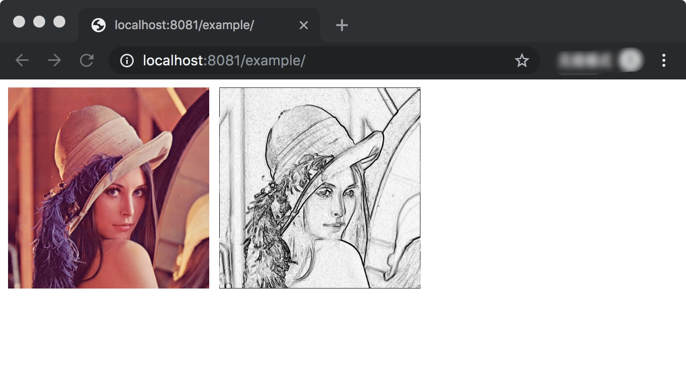

# 快速开始

> 注： 完整配置代码可参考 [pictool-example](https://github.com/chenshenhai/pictool-example)

## 准备环境

- 系统环境: Windows，macOS，Linux
- Node版本: 建议 `12.3+`


## 快速安装

### npm方式

```sh
npm i --save pictool
```

全量使用

```js
import Pictool from 'pictool';
```

按需使用

```js
import PictoolBrowser from 'pictool/dist/browser';
import PictoolUI from 'pictool/dist/ui';
import PictoolDigit from 'pictool/dist/digit';
```

### CDN方式

CDN全量使用

```html
<script src="https://unpkg.com/pictool/dist/index.js"></script>
```

CDN按需使用

```html
<script src="https://unpkg.com/pictool/dist/browser.js"></script>
<script src="https://unpkg.com/pictool/dist/digit.js"></script>
<script src="https://unpkg.com/pictool/dist/ui.js"></script>
```


## 简单的图像处理

### JavaScript代码

- 将图像处理素描效果
  - 步骤1: 设置图片URL(绝对路径或者相对路径)
  - 步骤2: 利用`sobel`算法计算处理图像边缘
  - 步骤3: 利用`invert`反色算法处理成边缘黑色效果

```js
import Pictool from 'pictool';

// 步骤1: 设置图片URL(绝对路径或者相对路径)
const src = './image/test.jpg';
const Sandbox = Pictool.browser.Sandbox;
const sandbox = new Sandbox(src);
const dom = document.querySelector('#J_Example_01');

sandbox.queueProcess([
  // 步骤2: 利用 sobel 算法计算处理图像边缘
  {
    process: 'sobel',
    options: {},
  },
  // 步骤3: 利用 invert 反色算法处理成边缘黑色效果
  {
    process: 'invert',
    options: {},
  }
]).then(function(base64) {
  dom.innerHTML = ``;
}).catch(function(err) {
  console.log(err);
});
```

### 页面代码

```html
<html lang="zh-CN">
  <head>
    <meta charset="UTF-8">
    <style>
      .box {float: left; margin-right: 10px;}
      img { max-height: 200px; min-width: 100px;}
    </style>
  </head>
  <body>
    <div class="box">
      
    </div>

    <div class="box" id="J_Example_01">
      
    </div>
    <script src="./index.js"></script>
  </body>
</html>
```

### 浏览器结果

> 注: 测试例子所用图片来源于网络

