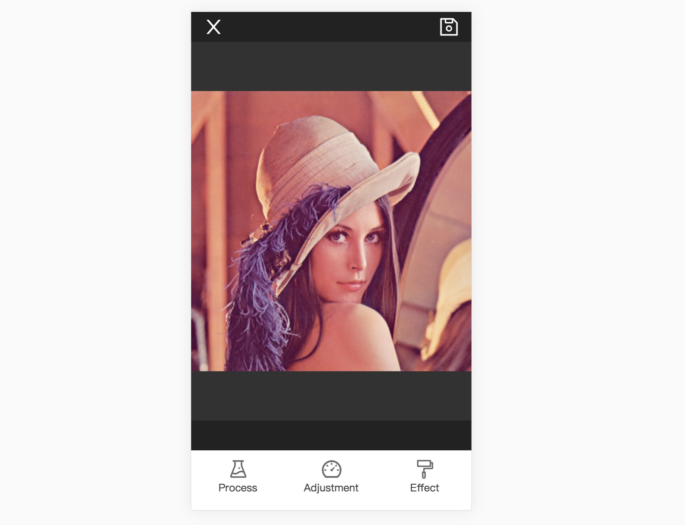

# Pictool.UI

## UI工具类

`Pictool.UI` 是聚合了 `Pictool`所有图像处理功能的UI工具，可以用来演示处理图片

## 快速使用

- 参数 `imgData {ImageData}` 是浏览器的图像数据类型参数
- 参数 `options` 
  - `options.uiConfig` UI配置
    - `zIndex {number}` 显示层级
    - `language {string}` 语言，有中文`zh-cn`和英文`en-us`两种选择，默认为英文`en-us`
  - `options.workerConfig` 后台线程配置，用于加速图像处理
    - `use {boolean}` 是否开启后台进程
    - `path {string}` 后台进程`worker.js`文件的相对地址

```js
const options = {
  // uiConfig: {
  //   zIndex: 1234,
  //   language: 'zh-cn',
  // },
  // workerConfig: {
  //   use: true,
  //   path: './../../dist/worker.js',
  // }
}
const pictoolUI = new Pictool.UI(imgData);
pictoolUI.show();
```
#### Pictool.UI 使用CDN例子

```html
<html>
  <head>
    <meta charset="UTF-8">
    <meta name="viewport" content="width=device-width,minimum-scale=1.0,maximum-scale=1.0,user-scalable=no">
    
    <style>
      .btn { margin: 100px auto; height: 60px; width: 200px; background: #cccccc;}
    </style>
    <script src="https://unpkg.com/pictool/dist/index.js"></script>
  </head>
  <body>

   <button id="J_Btn" class="btn">open Pictool.UI</button>
  </body>
  <script>
  (async function(Pictool) {
    const util = Pictool.browser.util;
    const PictoolUI = Pictool.UI;
    const imgData = await util.getImageDataBySrc('./assets/image/test.jpg');
    if (imgData instanceof Error) {
      console.log(imgData);
      return;
    }

    const pictoolUI = new PictoolUI(imgData);
    pictoolUI.show();

    document.querySelector('#J_Btn').addEventListener('click', function() {
      pictoolUI.show();
    });
  
  })(window.Pictool);
  </script>
</html>
```

> 注: 测试例子所用图片来源于网络




### Pictool.UI 简单图像处理


### Pictool.UI 调节


### Pictool.UI 效果


## UI.show

显示UI工具

```js
const pictoolUI = new Pictool.UI(imgData);
pictoolUI.show();
```

## UI.hide

隐藏UI工具

```js
const pictoolUI = new Pictool.UI(imgData);
pictoolUI.hide();
```